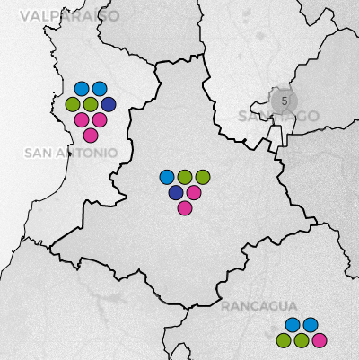

Inspired by [DecideChile](https://2021.decidechile.cl/#/ev/2021.nov/ct/2021.nov.D/){:target="_blank"}, [SERVEL](https://www.servel.cl/centro-de-datos/resultados-electorales-historicos-gw3/){:target="_blank"}, and [Wikipedia](https://es.wikipedia.org/wiki/Elecciones_parlamentarias_de_Chile_de_2021){:target="_blank"}, this project aims to develop
an interactive visualization of Chilean parliamentary elections for both chambers of Congress using Python, QGIS, Highcharts, and integrating several public sources. Created by <a href="https://sebastianriffo.github.io/" style="color:#E91E63" target="_blank">Sebastián RIFFO</a> as an open-source product, its codes, data, and shapefiles produced are available in this github [repository](https://github.com/sebastianriffo/congreso-chile){:target="_blank"}.

<!--

  <a class=mapbutton href="https://sebastianriffo.github.io/congreso-chile/en/maps/2022-2026_Diputados.html" target="_blank">
    
    
 <h4> Chamber of Deputies </h4> 

  </a> 

  <a class=mapbutton href="https://sebastianriffo.github.io/congreso-chile/en/maps/2022-2026_Senadores.html" target="_blank"> 
    
    
 <h4> Senate </h4> 

  </a>

-->

### Visualization

For every election, information is portrayed at three different levels:

  

    
    
 <h4> Individual results </h4> 
    Each icon represents the number of seats in the respective electoral division. If available, the detailed results are displayed, being possible to sort and filter them according to the elected members. 

  

  
  

    
    
 <h4> Results by electoral divisions </h4> 
    When interacting with an electoral district or senatorial constituency, the local results obtained by the main alliances are depicted. Otherwise, these are replaced by their overall votes. 

  

  
  

    
    
 <h4> Seat distribution </h4> 
    The composition of a chamber is presented in a apportionment diagram, with seats color-coded by alliances. These are further grouped by parties, each containing a list of their elected legislators. 

  

### The project
In the beginning, I just wanted to practice Python and challenge myself with something interesting, but instead of jumping into a competition, I decided to start my own project from scratch and see where it would lead me. Working on election data visualizations seemed suitable at the time, as I was committed to learning about apportionment methods. Soon enough, I realized I would need a large toolkit for developing what I had in mind, which is described below.

Web scraping, data cleansing and formatting was carried out using [Beautiful Soup](https://www.crummy.com/software/BeautifulSoup/bs4/doc/){:target="_blank"} and [Pandas](https://pandas.pydata.org/docs/user_guide/index.html){:target="_blank"}, both well-known Python libraries. The visualization part, which prioritizes interacting with constituencies rather than just data, was built on [Folium](https://python-visualization.github.io/folium/latest/){:target="_blank"}. For a newcomer like me, this library allows you to draw maps quickly, however its functionalities are quite rigid. A bit of JavaScript was necessary to tweak some, as well as HTML5/CSS to personalize certain elements. Since voting results are displayed on a table, [TableSorter (Mottie's fork)](https://mottie.github.io/tablesorter/docs/){:target="_blank"} came in handy. [Highcharts](https://www.highcharts.com/){:target="_blank"} was really helpful to construct an apportionment diagram and provide a broader view of an election.

If electoral data is accessible since the so-called transition to democracy, vector maps are typically up-to-date, being this the main issue when dealing with old constituencies' shapes. Hopefully, city boundaries have remained almost unchanged over the last 34 years, serving as a base to construct all election districts from 1989 onwards, with the help of [Shapely](https://shapely.readthedocs.io/en/stable/manual.html){:target="_blank"}.

Once finished, it made sense to extend the project to cover elections before 1989. I opted for the 1932-1973 period to bring some continuity, but also because electoral divisions slightly varied on those years. I used [pyQGIS](https://docs.qgis.org/3.28/en/docs/pyqgis_developer_cookbook/index.html){:target="_blank"} to georeference their boundaries, which was necessary due to the abrupt changes made to the country's divisions by the later civilian-military dictatorship, making it impossible to recreate them using the current city boundaries. As for voting results, candidates' information is no longer available, so I relied on the composition of each congressional term (La Nación, governmental newspaper back then, played a crucial role in verifying party affiliation). Eventually, I succeeded in reconstructing and balancing parties' results for some elections, drawing from multiple sources.

### Kwown issues
* SERVEL (electoral service) updated its website recently, displaying voting results for 1989-2021 in a different manner. Web scraping scripts now need to be adapted accordingly.

### Ongoing developments
* A legislators lookup tool, covering all legislative terms, is currently available [here](http://127.0.0.1:4000/es/search.html){:target="_blank"} (in Spanish only). Party affiliations during the 1828-1930 period still need validation.

<!--
* The composition of Congress during the 1828-1930 period is also available, yet several details require validation. When completed, this will help in developing a comprehensive legislators' database spanning all legislative terms.
-->

### Future work
* Inspired on [Naim Bro's work](https://link.springer.com/article/10.1007/s11186-022-09491-3){:target="_blank"}, I would like to construct a kinship network comprising past and current Congress members. 
