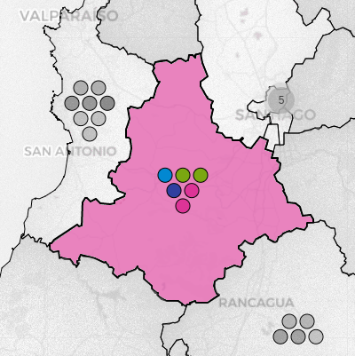
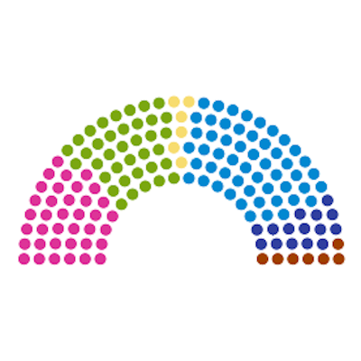

An interactive visualization of the chilean parliamentary elections from 1932 onwards, for both the Chamber of Deputies and the Senate. Inspired by [DecideChile](https://2021.decidechile.cl/#/ev/2021.nov/ct/2021.nov.D/){:target="_blank"}, [SERVEL](https://www.servel.cl/centro-de-datos/resultados-electorales-historicos-gw3/){:target="_blank"}, and [Wikipedia](https://es.wikipedia.org/wiki/Elecciones_parlamentarias_de_Chile_de_2021){:target="_blank"}, these representations have been developed using Python (folium, beautiful soup, pandas), QGIS and Highcharts, integrating several public sources.

For every election, the information is portrayed at three different levels: 

  

    
    
 <h4> Individual results </h4> 
    Each icon represents the number of seats in the respective electoral division. If available, the detailed results are displayed, being possible to sort and filter them according to the elected members. 

  

  
  

    
    
 <h4> Results by electoral divisions </h4> 
    When interacting with an electoral district or senatorial constituency, the local results obtained by the main alliances are showed. Otherwise, these are replaced by their overall votes. 

  

  
  

    
    
 <h4> Seat distribution </h4> 
    The composition of a chamber is exposed in a apportionment diagram, whose seats are colored by alliances. These are in turn grouped by parties, each containing a list of their elected legislators. 

  

