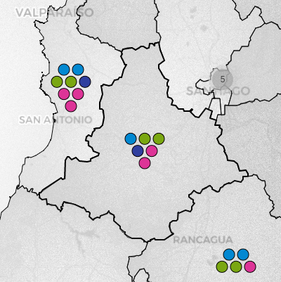
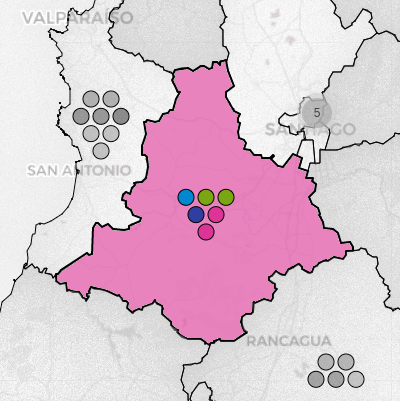
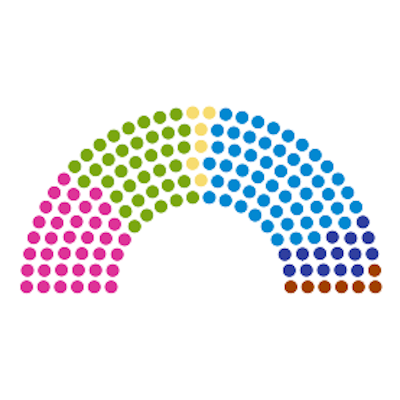

Inspirado en lo hecho por [DecideChile](https://2021.decidechile.cl/#/ev/2021.nov/ct/2021.nov.D/){:target="_blank"}, [SERVEL](https://www.servel.cl/centro-de-datos/resultados-electorales-historicos-gw3/){:target="_blank"} y [Wikipedia](https://es.wikipedia.org/wiki/Elecciones_parlamentarias_de_Chile_de_2021){:target="_blank"}, este proyecto busca desarrollar una visualización interactiva de las elecciones a ambas cámaras del Congreso Nacional de Chile, a partir de Python, QGIS, Highcharts e integrando diversas fuentes. Desarrollado por <a href="https://sebastianriffo.github.io/" style="color:#E91E63" target="_blank">Sebastián RIFFO</a> como un producto de código abierto, los códigos, datos y shapefiles generados se encuentran disponibles en [este repositorio](https://github.com/sebastianriffo/congreso-chile){:target="_blank"} en GitHub.

### Visualización
<!--

  <a class=mapbutton href="https://sebastianriffo.github.io/congreso-chile/es/mapas/2022-2026_Diputados.html" target="_blank">
    
    
 <h4> Elecciones a la Cámara de Diputados </h4> 

  </a>
  
  <a class=mapbutton href="https://sebastianriffo.github.io/congreso-chile/es/mapas/2022-2026_Senadores.html" target="_blank"> 
    
    
 <h4> Elecciones al Senado </h4> 
 
  </a>

-->

La información de cada elección se presenta en tres niveles:

  

    
    
 <h4> Resultados individuales </h4> 
    Cada ícono representa el número de parlamentarios a elegir en el territorio respectivo. De estar disponibles, se presentan los resultados detallados, pudiendo ser ordenados y filtrados según quienes fueron electos. 

  

  

    
    
 <h4> Resultados por territorio electoral </h4> 
    Al interactuar con un distrito o circunscripción, se muestra la votación obtenida por las principales coaliciones, y en caso contrario, sus resultados a nivel nacional. 
    

  

  

    
    
 <h4> Distribución de escaños </h4> 
    La composición de la cámara en cuestión se expone en un diagrama, cuyos escaños están coloreados por coalición y agrupados por partidos. Estos últimos contienen el listado de sus parlamentarios. 

  

### Motivación
En un principio, quería practicar Python y de paso hacer algo interesante. Si bien existen muchísimos cursos y competencias para ello, decidí empezar con un proyecto propio, para así ver que más podría aprender en el camino. En aquel entonces estaba estudiando métodos electorales, por lo que trabajar en una visualización de elecciones me pareció apropiado. Sin embargo, rápidamente caí en cuenta que necesitaría bastante más de lo presupuestado para sacar adelante esta idea.

La extracción, limpieza y estandarización de datos fueron hechas con [Beautiful Soup](https://www.crummy.com/software/BeautifulSoup/bs4/doc/){:target="_blank"} y [Pandas](https://pandas.pydata.org/docs/user_guide/index.html){:target="_blank"}, dos librerías estándar de Python. La visualización, que está enfocada en interactuar con el territorio más que con los datos, fue construida en [Folium](https://python-visualization.github.io/folium/latest/){:target="_blank"}. Esta librería, ideal para quien recién comienza, permite dibujar mapas de manera sencilla, aunque su principal desventaja es que sus funcionalidades son bastante limitadas. Por medio de JavaScript logré modificar algunas, e igualmente HTML/CSS me sirvió para personalizar ciertos elementos. Ya que los resultados se muestran en tablas, [TableSorter (Mottie's fork)](https://mottie.github.io/tablesorter/docs/){:target="_blank"} resultó ser bastante útil para ordenarlas. Finalmente, [Highcharts](https://www.highcharts.com/){:target="_blank"} fue de gran ayuda para construir un diagrama de reparto y así proveer una vision más amplia de una elección.

Si los datos son accessibles desde la *Vuelta a la Democracia*, los mapas vectoriales suelen estar al día, omitiendo versiones anteriores. Este fue el principal problema para trabajar con las divisiones electorales, pero gracias a que los límites comunales casi no han cambiado durante estos 34 años, pude utilizarlos para levantar todos los distritos y circunscripciones desde 1989 en adelante, por medio de [Shapely](https://shapely.readthedocs.io/en/stable/manual.html){:target="_blank"}.

Una vez terminado esto, la extensión natural de este proyecto es incluir las elecciones anteriores a 1989. Elegí partir por 1932-1973 para dar cierta continuidad, e igualmente pues las divisiones electorales no variaron mucho en tal período. Georreferencié sus límites gracias a [pyQGIS](https://docs.qgis.org/3.28/en/docs/pyqgis_developer_cookbook/index.html){:target="_blank"}, lo cual era necesario pues la posterior dictadura cívico-militar cambió drásticamente la división del país, 
no pudiendo reconstruirlos a partir de la información actual. En el caso de los resultados electorales, la información por candidato no está disponible, por lo que usé la composición de cada legislatura (La Nación, el diario estatal en la época, fue crucial para verificar las militancias partidarias). Eventualmente logré reconstruir y cuadrar los resultados de partidos en algunas elecciones, a partir de diversas fuentes.

### Problemas conocidos
* El sitio web del SERVEL (servicio electoral) cambió recientemente, mostrando los resultados de 1989-2021 en forma distinta. La parte de web scraping tendrá que ser adaptada a ello.

### En desarrollo
* Un buscador parlamentario, que considera todos los períodos legislativos, se encuentra disponible [aquí](http://127.0.0.1:4000/es/search.html){:target="_blank"}. Aún falta verificar y completar las militancias entre 1828 y 1930.

<!--
La composición del Congreso en 1828-1930 está disponible, pero falta verificar ciertos datos. Una vez terminado, esto será útil para construir una base de datos parlamentaria que considere todas las legislaturas.
-->

### Trabajo Futuro
* Inspirado en lo hecho por [Naim Bro](https://link.springer.com/article/10.1007/s11186-022-09491-3){:target="_blank"}, me gustaría construir una red de parentezco de los parlamentarios antiguos y actuales.
